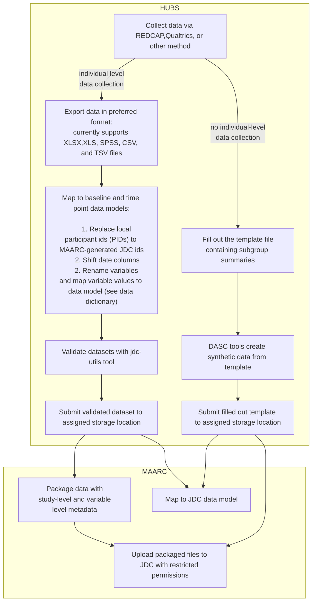

# JDC submission procedures

## Purpose

In previous quarters, we have collected and harmonized data for a subset of the core measures (ie baseline demographic and substance use). For each quarter, the goal is to continue to build towards a “frictionless” solution that accommodates variation in data collection strategies and instruments. For this quarter, we focus on bringing a data validation tool to individual hub staff by (1) validating data submissions and (optionally) (2) using tools to transform data into a format that passes validation.


## Data harmonization and validation

Hubs take good care of ensuring data quality and take measures for a high degree of internal validity and a set common core measures exist. However, different hubs may collect, organize, and label data slightly differently due to study design and instrument preference. Therefore, a set of data transformations may be required to conform to the JDC data model.

These may include simple transformations such as changing variable names or value labels but may also include a combination of filtering and aggregation transformations for some instruments. Additionally, to satisfy de-identification requirements, local ids must also be mapped to a set of JDC ids. 

In subsequent sections, we will detail (1) the data model and (2) tools that facilitate replacing local ids with JDC ids, transforming data, and validating these data. Note, the only two mandatory requirements are the use of JDC ids (with or without the use of our tools; we provide a list of JDC ids for mapping) and passing validation (which requires the use of our validation tool).

## Validated File Submission

When your data files have passed the validation step (ie conform to the baseline or time point data models), please upload files to your assigned storage location. For a link to this location, contact Mike Kranz ( kranz-michael@norc.org). This validated data will then be uploaded to the JDC for (1) NIDA quarterly reporting and (2) for people granted access, to download data and leverage cloud-based workspaces to perform collaborative analyses by combining individual hub data with a variety of different open-source datasets and other hub datasets (if permissions are granted). 

## Data submission flow

While some hubs can submit individual level data for staff and/or clients, others can contractually only submit summary data. Below represents a flow chart of the current data workflow. That is, the figure maps the journey from local hub data collection to uploading data on the JDC.

For individual data collection, see the [instructions](#jdc-utils-command-line-tool) on using the MAARC to (optionally) facilitate tranformation and (required) validation tools.



## jdc-utils command line tool 

Contact [Mike Kranz](kranz-michael@norc.org) for set up and troubleshooting.

### Install dependencies
To use the tool, first. Note, if you already have a python, git installation,
and virtual environment manager (ie virtualenv or conda), you're ready to go! Note, git is used to store the history of local ids and other 

 If not, here's one way:

1. Install latest version of python [here](https://www.python.org/downloads/)
   - alternatively, one can install conda, preferably the miniconda version, [here](https://docs.conda.io/en/latest/miniconda.html)
2. Install git
   - if using windows, [use git for windows](https://gitforwindows.org/). If using a mac, git comes pre-installed.
3. Add git and python to your `PATH`.
   - if using windows: 
      1. go to `Edit environment variable`
      2. add the git and python paths (double clicking or pressing `Edit...` on `Path` variable)

   - Probable paths if using windows:
      - Git: 
   `C:\Users\<username>\AppData\Local\Programs\Git\cmd`
      - Python: `C:\Users\<username>\AppData\Local\Programs\Python\Python310\Scripts\`

### Setting up tool
1. Open a command prompt
2. [this step will be in future hub onboarding] Create a git repository to store id mapping history (if applicable) 
3. Create a virtual environment with python utilities installed:

If using conda:

`conda create -n jdc-utils pip`

4. Install jdc-utils tool

While the location of the package will likely change, currently one can install with this command:

`pip install git+https://github.com/norc-heal/jdc-utilities.git`

## Usage
The idea behind this version of the jdc utilities is three-fold. 

1. To provide tools to build a stand-alone data package (that includes metadata and data) via the frictionless framework and software suite of tools.
2. To expose a command line interface to make these tools easier to use and easier to understand intermediate steps. For example, to see how 
the replace id function has replaced ids, to compare the shifted to non shifted dates, and finally to view the transformed dataset that either passed
validation (ie conformed to the given data model or did not). 
3. To provide tools to automatically go from this stand-alone (but harmonized) data package into the JDC data model for quick exploration of important variables.


This workflow provides a scalable way to manage different hub data collection procedures and general enough that many of these elements can be generalized to other use cases. 

## Options for using tools

There are several options to use these jdc utilities.

1. Use these tools directly in python scripts.
2. Use the command line interface with all the individual parameters.
3. Use the command line interface with configuration files that store the input parameters.

### Replacing local ids with JDC ids

```
C:\Users\kranz-michael\cmder
(jdc-utils) λ jdc-utils replace-ids --help
Usage: jdc-utils replace-ids [OPTIONS]

  This function is used to replace (and map) local ids assigned at the time
  of data collection with separate ids generated by the DASC and given to
  hubs.

  Replacing local ids with JDC specific ideas reduces the risk of hub and
  participant identification.

  The mapped local to JDC ids are intended to be seen only by hub staff.

  IN DEVELOPMENT: Additionally, this function accepts remote version control
  history (ie git repo) to save previous versions.

Options:
  --file-path TEXT    Path to a file with locals/old ids to be replaced. Can
                      specify multiple files if need to replace ids across
                      multiple files

  --id-file TEXT      Path to where the generated ids (created by the MAARC
                      and distributed to hubs) exist

  --map-file TEXT     Path to csv where the id mappings are stored -- this
                      will be generated if file does not exist

  --map-url TEXT      Git bare repo set up -- ie the "remote url" for sharing
                      mapped ids

  --column TEXT       Name of column across files specified with old (or
                      local) ids.     If none specified, defaults to first
                      level (ie 0) pandas dataframe index

  --config-file TEXT  A configuration file containing all required replace-id
                      fields

```

### Shifting dates

```
(jdc-utils) λ jdc-utils shift-dates --help
Usage: jdc-utils shift-dates [OPTIONS]

  This function takes a specified date field and shifts them around a
  specified number of days (ie shift amount). This shifted amount is
  selected randomly within an interval of the previous 182 days and next 182
  days. This shift amount is fixed within each individual such that the
  intervals between dates are retained to provide the  capability to
  calculate derived variables such as days from a given visit/timepoint
  (e.g., days from baseline or  days from release).

  As with the replace id function, the mappings (i.e., id to the random # of
  days shifted) is stored in a separate file to reduce deductive disclosure
  risk from PII linkage with date variables.

  However, by storing this shift amount (rather than randomly shifting at
  each data update,  the exact dates can be recovered simply by subtracting
  this added random amount to the shifted date.

  IN DEVELOPMENT: Additionally, this function accepts remote version control
  history (ie git repo) to save previous versions.

Options:
  --file-path TEXT    Path to a file with dates to be shifted. Can specify
                      multiple files if column name is the same across files

  --map-file TEXT     path to csv where the id mappings are stored -- this
                      will be generated if file does not exist

  --map-url TEXT      Git bare repo set up -- ie the "remote url" for sharing
                      mapped ids (optional)

  --id-column TEXT    Name of column across files specified ids.
  --date-column TEXT  Name of date column(s) to be shifted
  --config-file TEXT  A configuration file containing all required shift date

```

### Transformation utility for harmonizing datasets to data models
Transforming data currently leverages functions written with pandas and pandas-flavor decorator.

It is a simple two step process:

1. Read in data file to a data frame
    - `transforms.read_df(filepath)` function from specified data file path 
2. Transform data frame to JDC properties and values
    - `transforms.run_transformfile(df,transformfile)` function from the transform functions specified in a transforms.yaml file (which itself is specified in the config.yaml file) on the dataframe


```
(jdc-utils) λ jdc-utils transform --help
Usage: jdc-utils transform [OPTIONS]

The transform function runs through a series of transforms (eg renaming )

Options:
  --transform-file TEXT  Path to the given transform file
  --file-path TEXT       Path to the given dataset file
  --help                 Show this message and exit.

```

This transformfile contains a way to specify transforms within a simple text file called a "yaml" file:

Specifies the function, paramater name and parameter input
to be run on input data in a yaml file:

```yaml
<name of registered/valid pandas function>:
    <name of function parameter>: <paramter input (this may be a string, list, or dictionary)>
```

Examples:

Example native pandas functions :

*Rename columns:*

```yaml
rename:
    columns:
        d4_b: gender
        record_id: submitter_id
```

is intended to run:

```python
df.rename(columns={
    'd4_b':'gender',
    'record_id':'submitter_id'
})

```
### Validating your harmonized dataset

The validate command uses frictionless table schema to validate the table
and give useful feedback in terms of what needs to be transformed.

If it it passes, then the dataset will be saved and ready for submission.

```
(jdc-utils) λ jdc-utils validate --help
Usage: jdc-utils validate [OPTIONS]

Options:
  --schema-path TEXT              Frictionless table schema JSON or YAML file
                                  path

  --file-path TEXT                Path to dataset file(s)
  --file-type [baseline|time-points]
                                  Type of file(s). Currently either baseline
                                  or time-points

```


