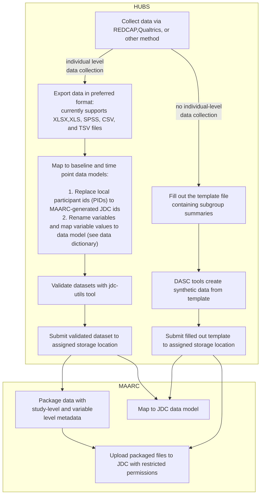

# JDC submission procedures

## Purpose

In previous quarters, we have collected and harmonized data for a subset of the core measures (ie baseline demographic and substance use). For each quarter, the goal is to continue to build towards a “frictionless” solution that accommodates variation in data collection strategies and instruments. For this quarter, we focus on bringing a data validation tool to individual hub staff by (1) validating data submissions and (optionally) (2) using tools to transform data into a format that passes validation.


## Data harmonization and validation

Hubs take good care of ensuring data quality and take measures for a high degree of internal validity and a set common core measures exist. However, different hubs may collect, organize, and label data slightly differently due to study design and instrument preference. Therefore, a set of data transformations may be required to conform to the JDC data model.

These may include simple transformations such as changing variable names or value labels but may also include a combination of filtering and aggregation transformations for some instruments. Additionally, to satisfy de-identification requirements, local ids must also be mapped to a set of JDC ids. 

In subsequent sections, we will detail (1) the data model and (2) tools that facilitate replacing local ids with JDC ids, transforming data, and validating these data. Note, the only two mandatory requirements are the use of JDC ids (with or without the use of our tools; we provide a list of JDC ids for mapping) and passing validation (which requires the use of our validation tool).

## Validated File Submission

When your data files have passed the validation step (ie conform to the baseline or time point data models), please upload files to your assigned storage location. For a link to this location, contact Mike Kranz ( kranz-michael@norc.org). This validated data will then be uploaded to the JDC for (1) NIDA quarterly reporting and (2) for people granted access, to download data and leverage cloud-based workspaces to perform collaborative analyses by combining individual hub data with a variety of different open-source datasets and other hub datasets (if permissions are granted). 

## Data submission flow

While some hubs can submit individual level data for staff and/or clients, others can contractually only submit summary data. Below represents a flow chart of the current data workflow. That is, the figure maps the journey from local hub data collection to uploading data on the JDC.

For individual data collection, see the [instructions](#jdc-utils-command-line-tool) on using the MAARC to (optionally) facilitate tranformation and (required) validation tools.



## jdc-utils command line tool 

Contact [Mike Kranz](kranz-michael@norc.org) for set up troubleshooting.

### Install dependencies
To use the tool, first. Note, if you already have a python, git installation,
and virtual environment manager (ie virtualenv or conda), you're ready to go! If not, here's one way:

1. Install latest version of python [here](https://www.python.org/downloads/)
   - alternatively, one can install conda, preferably the miniconda version, [here](https://docs.conda.io/en/latest/miniconda.html)
2. Install git 
   - if using windows, [use git for windows](https://gitforwindows.org/). If using a mac, git comes pre-installed.
3. Add git and python to your `PATH`.
   - if using windows: 
      1. go to `Edit environment variable`
      2. add the git and python paths (double clicking or pressing `Edit...` on `Path` variable)

   - Probable paths if using windows:
      - Git: 
   `C:\Users\<username>\AppData\Local\Programs\Git\cmd`
      - Python: `C:\Users\<username>\AppData\Local\Programs\Python\Python310\Scripts\`

### Setting up tool
1. Open a command prompt
2. Create a git repository to store id mapping history (if applicable) 
   - TODO: `<add command here> or potentially expose with command line tool`
3. Install jdc-utils tool

`pip install git+<TO ADD GIT PATH>`

## Usage

TODO: add Usage CLI text


```
(jdc-utils) λ jdc-utils --help
Usage: jdc-utils [OPTIONS] COMMAND [ARGS]...

  CLI for JDC utilities

Options:
  --help  Show this message and exit.

Commands:
  replace-ids
  transform
  validate
  ```


### Replacing local ids with JDC ids

TODO: add examples/instructions/Usage CLI text


```
(jdc-utils) λ jdc-utils replace-ids --help

Usage: jdc-utils replace-ids [OPTIONS]

Options:
  --file-path TEXT  Path to a file with locals/old ids to be replaced. Can
                    specify multiple files if need to replace ids across
                    multiple files  [required]

  --id-file TEXT    path to csv where the id mappings are stored -- this will
                    be generated if file does not exist  [required]

  --map-file TEXT   Path to where the git repository supporting the versioning
  --map-url TEXT    Git bare repo set up -- ie the "remote url" for sharing
                    mapped ids

  --column TEXT     Name of column across files specified with old (or local)
                    ids. If none specified, defaults to first level (ie 0)
                    pandas dataframe index

  --help            Show this message and exit.
```

### Transformation utility for harmonizing datasets to data models

TODO: add examples/instructions/Usage CLI text

```
(jdc-utils) λ jdc-utils transform --help

Usage: jdc-utils transform [OPTIONS]

Options:
  --transform-file TEXT  Path to the given transform file
  --file-path TEXT       Path to the given file
  --help                 Show this message and exit.
```

### Validating your harmonized dataset

TODO: add examples/instructions/Usage CLI text

```
(jdc-utils) λ jdc-utils validate --help
Usage: jdc-utils validate [OPTIONS]

Options:
  --schema-path TEXT              Frictionless table schema JSON or YAML file
                                  path

  --file-path TEXT                Path to a file. Can specify multiple files
                                  if fields span multiple files

  --file-type [baseline|time-points]
                                  Type of file(s). Currently either baseline
                                  or time-points

  --help                          Show this message and exit.
```


