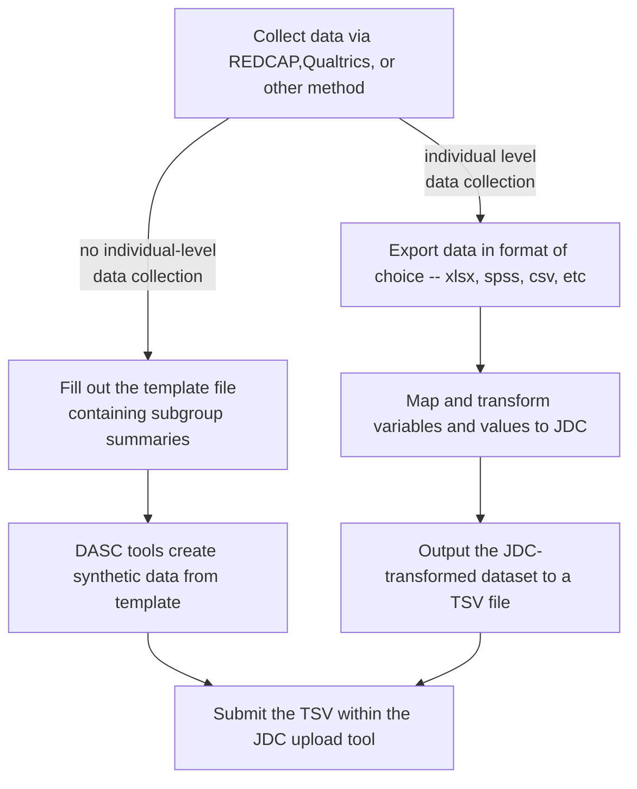

# JDC submission procedures

## Submission workflow/steps

## How to map to JDC

Provide descriptions of each column and further process

### Example 1 

| Variable Category | JDC Variable Category | JDC Variable Name | JDC Variable Description | Possible JDC Variable Values | Potential local --> JDC variable name mappings | Potential local --> JDC value transformations | Link to example |
|---|---|---|---|---|---|---|---|
| General participant | participant | quarter_enrolled | blah blah blah from JDC data model | Q42021, Q32021, etc | date_recruited --> quarter_enrolled (link to example line in yaml) | the date of recruitment to the quarter enrolled (link to example line in yaml) |  |
| Demographics | demographic | gender | blah blah blah from JDC data model | Male,Female,Gender non conforming |  |  |  |

### Example 2
| Variable Category | Variable Name | Variable Name in JDC | Possible Values | Priority | Description | Example local --> JDC variable   name mappings | Example  local --> value transformations |
|---|---|---|---|---|---|---|---|
| participant | Participant ID |    submitter_id    |    string    | Required |    Unique id for participant    | [Rename a column called participant_id to submitter_id]() | [Replace local values with JDC values]() |
| participant | Role in Project |    role_in_project    |    Client,Staff    | Required |    Are they a client or research staff?    |  |  |
| participant | Quarter recruited |    quarter_recruited    |    string    | Required |    The quarter and year in which recruited   for first study in the format of XXXXqX (e.g., 2020q1 for year 2020, Quarter   1).    | date_recruited -->   quarter_enrolled (link to example line in yaml) | the date of recruitment to the   quarter enrolled (link to example line in yaml) |
| participant | Protocol submitter ID |    protocols.submitter_id    |    Any string    | Required | The unique submitter id of a study   protocol | "main" for all hubs  | NA |
| demographic | Participant Demographic ID |    submitter_id    |    string    | Required |    Unique id for demographic    |  |  |
| demographic |  |    race    |    White,Black, Alaskan, Asian, Some Other   Race (SPECIFY)    | Required |    What is your race? SELECT ALL THAT APPLY    | d3 to race | explain the collapse function and link to yaml |
| demographic |  |    participants.submitter_id    |    array    |  |    No Description    |  |  |
| demographic |  |  |    object    |  |  |  |  |
| demographic |  |    hispanic    |    Yes, No, Not reported    |  |    Are you of Hispanic, Latino, or Spanish   origin?    |  |  |
| demographic |  |    gender    |    Male      Female      Transgender      Gender nonconforming      Something else      Not reported    |  |    What is your gender identity?    |  |  |

## How to use the submission tool on JDC

