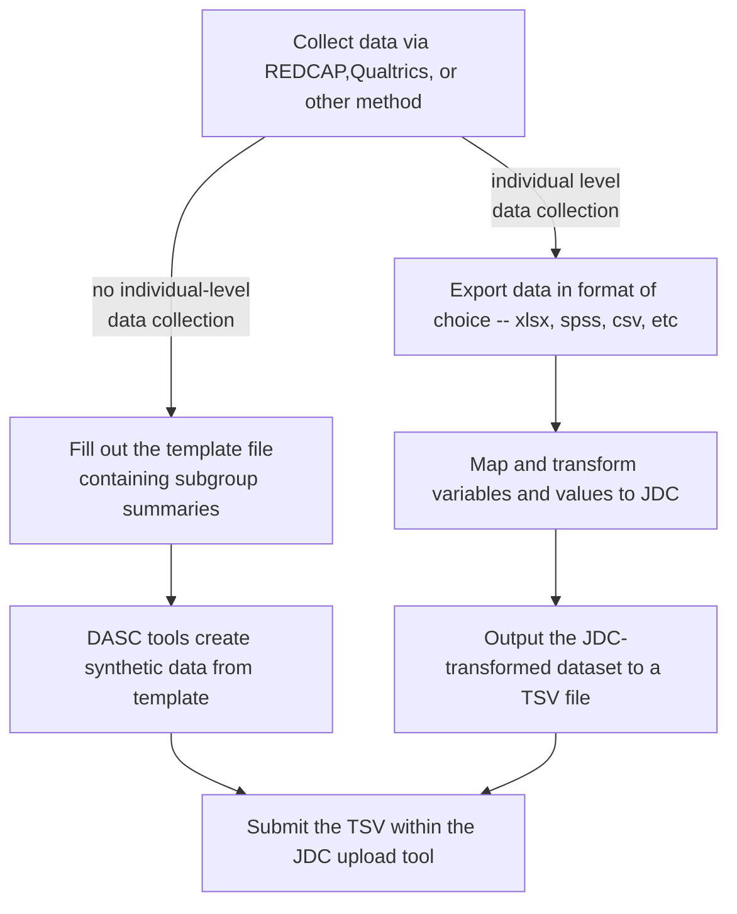

# JDC submission procedures

## Purpose

In previous quarters, we have collected and harmonized data for a subset of the core measures (ie baseline demographic and substance use). For each quarter, the goal is to continue to build towards a “frictionless” solution that accommodates variation in data collection strategies and instruments. For this quarter, we focus on bringing the data validation tools to individual hub staff by  (1) validating data submissions and (optionally) (2) using tools to transform data into a format that passes validation.

## Data harmonization and validation

Hubs take good care of ensuring data quality and take measures for a high degree of internal validity and a set common core measures exist. However, different hubs may collect, organize, and label data slightly differently due to study design and instrument preference. Therefore, a set of data transformations may be required to conform to the JDC data model.

These may include simple transformations such as changing variable names or value labels but may also include a combination of filtering and aggregation transformations for some instruments. Additionally, to satisfy de-identification requirements, local ids must also be mapped to a set of JDC ids. 

In subsequent sections, we will detail (1) the data model and (2) tools that facilitate replacing local ids with JDC ids, transforming data, and validating these data. Note, the only two mandatory requirements are the use of JDC ids (with or without the use of our tools; we provide a list of JDC ids for mapping) and passing validation (which requires the use of our validation tool).

## Validated File Submission

When your data files have passed the validation step (ie conform to the JDC data models), please upload files to your designated secure Box folder. For a link to this folder, contact Mike Kranz ( kranz-michael@norc.org). This validated data will then be uploaded to the JDC for (1) NIDA quarterly reporting and (2) for people granted access, to download data and leverage cloud-based workspaces to perform collaborative analyses by combining individual hub data with a variety of different open-source datasets and other hub datasets (provided permissions are granted). 
Data submission flow
While some hubs can submit individual level data for staff and/or clients, others can contractually only submit summary data. Below represents a flow chart of the current data workflow. That is, the figure maps the journey from local hub data collection to uploading data on the JDC.

## File Format

1. The preferred file format for submissions is tab-delimited ASCII (UTF-8 encod-
ing), with the first row containing the column names. Alternatively, an Excel file
may be submitted, also with column names in the first row.

2. If you do submit an Excel file, please note that any special formatting (e.g., the
use of bold, color, highlighting, etc.) will be ignored, as only the data themselves
will be read out of the file.

3.  If you wish to leave a field blank because the item is inapplicable or the infor-
mation is unavailable, simply leave the corresponding cell empty (do this for
both string and numeric fields). Do not use zeros, periods, or other characters to
indicate missing data. Note that this is different from the response "Unknown"
which should be used as indicated in the field definitions below.

## Submission workflow/steps

