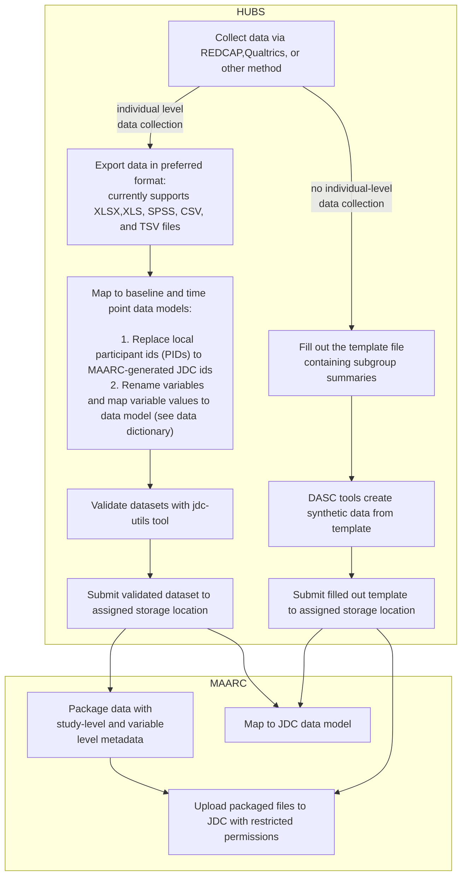

# JDC submission summary

## Purpose

 The ultimate goal for the JDC submission process is to build  a “frictionless” solution (ie set of tools and package) that accommodates transforming various data collection strategies and instruments and each hub's technical background into a HIPPAA-compliant, haromonized data collection packaged with useful study and dataset level metadata. Our tools (in development) aim to support a workflow ranging from novel de-identification tools, data transformations, and data validation.

 Currently, these tools are being developed to accomodate both non-hub data and core measure hub data (see below) with an eye towards HEAL initiative standards and development.

## Hub Data Core Measures

The core measures are divided into two data models. 

- **Measures collected only at baseline**

   - Measures such as demographic measures that are only asked at the baseline session. Each observation or record is on the "person" level.
   - See the [baseline codebook](baseline_fields.md) for detailed information on each measure.
- **Measures collected at all time points**

   - Measures asked at each time point such as substance use, treatment preferences, justice involvement, etc. Each observation or record is on the "visit" or "timepoint" level (i.e., both the baseline and follow up sessions)
   - See the [time point codebook](time_point_fields.md)

## ETL process

Hubs take good care of ensuring data quality and take measures for a high degree of internal validity and a set common core measures exist. However, different hubs may collect, organize, and label data slightly differently due to study design and instrument preference. Therefore, a set of data transformations may be required to conform to the JDC data model.

These may include simple transformations such as changing variable names or value labels but may also include a combination of filtering and aggregation transformations for some instruments. Additionally, to satisfy de-identification requirements, local ids must also be mapped to a set of JDC ids in addition to shifting dates around a random number of days. 

## Data workflow

While some hubs can submit individual level data for staff and/or clients, others can contractually only submit summary data. Below represents a flow chart of the current data workflow. That is, the figure maps the journey from local hub data collection to uploading data on the JDC.

For individual data collection, the DASC is working with hubs to iterate on an efficient solution to facilitate tranformation and (required) validation tools. These tools, usable via a command line interface (CLI) or in python, support robust de-identification functions, data transformations, and 
data validation.

